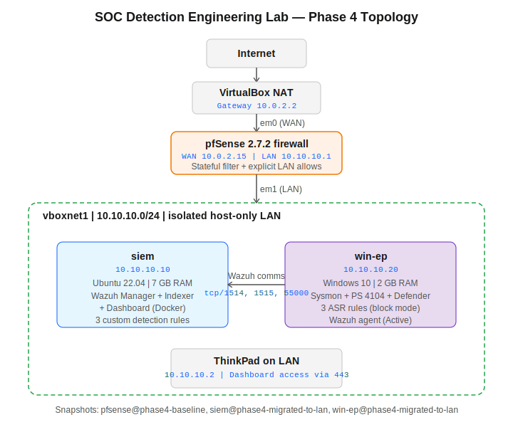

# Open MDR Home Lab

> An open-source Managed Detection & Response stack built as a personal home lab — Wazuh SIEM, n8n SOAR, pfSense + Suricata integration, behavioural detection mapped to MITRE ATT&CK, and automated bilingual alerting.

---

## About this project

A learning and portfolio project that demonstrates detection engineering, SOAR automation, and SOC operations using only open-source tools. It is **not** a commercial product and is **not** deployed for any client. Everything runs locally on a single hypervisor host.

Built as a clean-room exercise in lab — no shared code, configuration, or assets with any commercial project or academic capstone.

---

## Stack

| Layer | Tool | Role |
| --- | --- | --- |
| SIEM | Wazuh 4.9 (Manager + Indexer + Dashboard) | Log aggregation, correlation, FIM, vulnerability scanning |
| Search / index | OpenSearch (Wazuh Indexer) | Indexed alert and event storage |
| Windows telemetry | Sysmon (sysmon-modular) + Wazuh agent + ASR rules | Process, network, file, registry, DNS, LSASS access |
| Case management | TheHive 5 + Cassandra | Alert to Case lifecycle |
| Threat enrichment | Cortex + analyzers (VirusTotal, AbuseIPDB) + custom analyzer | IOC enrichment |
| SOAR | n8n | Alert routing, auto-response orchestration |
| Network IDS / firewall | pfSense + Suricata | L3/L4 detection, automated blocking via API |
| Detection rules | Wazuh + Sigma + YARA | Custom + community |

---

## Detection coverage

Every rule maps to a MITRE ATT&CK technique.

| Threat | Detection method | MITRE technique |
| --- | --- | --- |
| Ransomware | FIM mass-encryption + entropy spike + known extensions + Sysmon ID 23 | T1486 |
| Brute force (RDP / SSH) | Auth-failure correlation (4625 / sshd) | T1110 |
| Credential dumping (LSASS) | Sysmon ID 10 + ASR rule | T1003.001 |
| Obfuscated PowerShell | Script Block Logging (Event 4104) | T1059.001 |
| Living-off-the-land | certutil / wmic / mshta abuse | T1218 |
| Persistence | Scheduled tasks (4698), run keys, cron | T1053 / T1547 |
| Lateral movement | Internal SMB / PsExec patterns | T1021 |
| Privilege escalation | sudo misuse, token abuse | T1068 |
| Data exfiltration | Large outbound transfers | T1041 |
| Vulnerability exposure | Wazuh vulnerability detector (NVD feed) | - |

---

## Lab environment

| VM | OS | RAM | vCPU | Disk | Role |
| --- | --- | --- | --- | --- | --- |
| siem | Ubuntu Server 22.04 | 9 GB | 4 | 120 GB | Wazuh + n8n + TheHive + Cortex |
| win-ep | Windows 10 | 3 GB | 2 | 60 GB | Endpoint with Sysmon + ASR |
| fw | pfSense 2.7 | 512 MB | 1 | 16 GB | Gateway + Suricata IDS |

Host: 16 GB RAM, VirtualBox 7.x, Windows 11.

---

## Project status

| Phase | Status |
| --- | --- |
| Phase 1: Wazuh stack deployment | Done |
| Phase 2: Windows endpoint + Sysmon | In progress |
| Phase 3: TheHive + Cortex + n8n | Pending |
| Phase 4: Detection rules + MITRE mapping | Pending |
| Phase 5: pfSense + Suricata integration | Pending |
| Phase 6: Attack scenarios + documentation | Pending |

---

## Notes

This project is independent of any academic capstone work or commercial product. It exists purely as a learning artefact and a portfolio demonstration of open-source MDR architecture.

All attack simulations target only lab VMs that you control. Do not run them against any system you do not own.

---

## License

MIT
