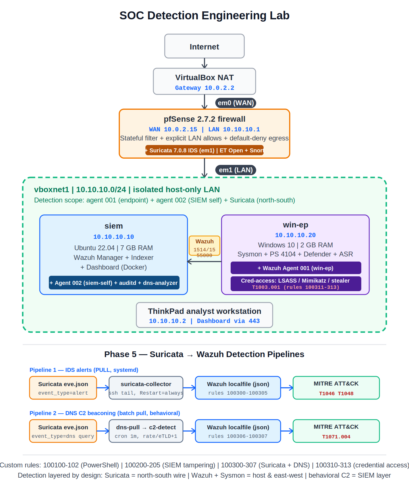

# Homelab MDR — SOC Detection Engineering Lab



---

## Overview

A hands-on lab demonstrating detection engineering with open-source tools: collecting Windows and Linux telemetry into a SIEM, running a network IDS at the firewall, writing custom detection rules, mapping every detection to MITRE ATT&CK, and hardening the monitoring stack itself. Everything is version-controlled, with each build phase documented alongside its design rationale.

The lab is built in phases — infrastructure and visibility first, then detection content, then response automation. Phases 1–5 are implemented and working; Phases 6–7 are the planned roadmap.

Everything runs locally on a single hypervisor host. All attack simulations target only lab VMs under my control.

---

## Status

| Phase | Scope | State |
| --- | --- | --- |
| 1 — Foundation | VMs, network, Docker, Wazuh stack (Manager + Indexer + Dashboard) | ✅ Implemented |
| 2 — Hardening | UFW, fail2ban, SSH hardening, index retention | ✅ Implemented |
| 3 — Windows telemetry | Sysmon (sysmon-modular), PowerShell Script Block Logging (4104), ASR, Defender → Wazuh agent | ✅ Implemented |
| 4 — Network re-architecture | pfSense in-path gateway, LAN segmentation | ✅ Implemented |
| 4.5 — SIEM self-monitoring | Agent on the SIEM + auditd, tamper detection for the monitoring stack | ✅ Implemented |
| 5 — Network IDS + DNS detection | Suricata on pfSense + Suricata→Wazuh pipeline, DNS tunneling + behavioral C2 beaconing | ✅ Implemented |
| 6-A — SOAR pipeline | Wazuh → n8n integration, high-severity alert triage and routing | ✅ Implemented |
| 6-B — Automated response | Cortex enrichment + pfSense API block (TTL + RFC1918 allowlist + circuit breaker) | ⏳ Roadmap |
| 6-C — Case management | TheHive 5 + Cassandra | ⏳ Roadmap |
| 7 — Threat simulation | Ransomware profile (T1486) run end to end against the stack | ⏳ Roadmap |

---

## Architecture

pfSense sits in-path as the gateway, so all routed traffic passes through it — the natural place for a network IDS. Endpoints report host telemetry to the SIEM; Suricata reports network detections. Detection is layered on purpose: no single sensor sees everything.

| VM | OS | RAM | Role | IP |
| --- | --- | --- | --- | --- |
| `siem` | Ubuntu Server 22.04 | 7 GB | Wazuh Manager + Indexer + Dashboard (Docker Compose) | 10.10.10.10 |
| `win-ep` | Windows 10 | 2 GB | Endpoint: Sysmon + ASR + Wazuh agent | 10.10.10.20 |
| `pfSense` | pfSense 2.7.2 | 2 GB | In-path gateway + Suricata 7.0.8 IDS | 10.10.10.1 |
| Host | Windows + VirtualBox | 16 GB | Hypervisor | 10.10.10.2 |

Network: LAN `10.10.10.0/24`, pfSense in-path (WAN via NAT), default-deny egress.

---

## Detection engineering

Every custom rule is mapped to a MITRE ATT&CK technique, with IDs namespaced by phase. The table below lists **detections I wrote and verified firing** — not planned coverage.

### Custom detections (rules I wrote)

| Technique | Detection | Layer | Rule IDs |
| --- | --- | --- | --- |
| T1046 — Network Service Discovery | Custom Suricata SYN-scan signatures → Wazuh MITRE rules | Network | Suricata 1000001/1000002 → 100300–100304 |
| T1048 — Exfiltration Over Alternative Protocol | Suricata long-subdomain DNS heuristic → Wazuh | Network (DNS) | Suricata 1000003 → 100305 |
| T1071.004 — Application Layer Protocol: DNS | Behavioral C2 beaconing (rate-based, per eTLD+1) via custom SIEM-layer analyzer | SIEM (behavioral) | 100306 / 100307 |
| T1059.001 — PowerShell | Script Block Logging (Event 4104) obfuscation patterns | Endpoint | 100100–100102 |
| T1003.001 — LSASS Memory | comsvcs.dll MiniDump detected via **process command line (Sysmon EID 1)** — EID 10 is dropped by event-size limits, so EID 1 is the reliable path | Endpoint | 100311 |
| Credential theft — Mimikatz | Mimikatz signatures in PowerShell 4104 script blocks | Endpoint | 100312 |
| Credential theft — browser stores | Browser credential-store access (esentutl / Login Data) | Endpoint | 100313 |
| T1562.001 / T1611 / T1610 / T1548.003 / T1098 / T1543.002 / T1562.004 | SIEM self-monitoring (auditd) — tamper detection for the monitoring stack | SIEM host | 100200–100205 |

### The DNS behavioral C2 detection (Phase 5)

Signature matching is the weakest tier of the Pyramid of Pain — rewrite the tool and the signature is dead. Rather than fingerprint a C2 tool, this detection targets an **intrinsic property of the C2 channel**: beaconing repetition. A rate-based analyzer groups DNS queries by `(src_ip, eTLD+1)` over a rolling window and flags parents whose query volume is anomalous, with an allowlist for legitimate high-volume domains.

```
Suricata eve.json (pfSense)
  → edge filter: event_type=dns, type=query   (answers dropped at the sensor)
  → dns-pull.sh — byte-offset batch pull via cron (no persistent tail, no collision with the alert collector)
  → c2-detect.py — rate-based analyzer, eTLD+1 grouping, allowlist → SOAR-ready JSON alert
  → /var/log/dns-analyzer/alerts.json  (Docker bind-mount into Wazuh)
  → Wazuh JSON decoder → rules 100306/100307 → MITRE T1071.004
```

The analyzer lives in the SIEM layer, not the IDS — clean separation of concerns: Suricata reads the wire, the analyzer reasons about behavior, Wazuh correlates and alerts. Alerts are emitted as SOAR-ready JSON (`parent_domain` + `src_ip` + `query_count`) so Phase 6 can enrich and act on them directly.

### The Suricata → Wazuh alert pipeline (Phase 5)

```
Suricata eve.json (pfSense)
  → edge filter: event_type=alert only (protocol logs dropped at the sensor)
  → SSH stream, siem PULLs via a systemd service (Restart=always)
  → /var/log/suricata-pfsense/eve-alerts.json  (Docker bind-mount into Wazuh)
  → Wazuh JSON decoder → custom rules 100300–100305 → MITRE
```

The collector runs as a systemd service on the SIEM (`Restart=always`), so it self-recovers from dropped connections, host suspend, or crashes — no manual watchdog.

### Extended by community rulesets (enabled, not authored here)

Broad coverage layered on top of the custom rules, so the lab isn't blind between custom detections:

- **Sysmon-modular + Wazuh community (host-side):** LOLBAS abuse (certutil / mshta / wmic and similar living-off-the-land binaries), lateral movement (WinRM / Invoke-Command / PsExec patterns), scheduled tasks, image loads, file drops, LSASS *access* events.
- **ET Open + Snort GPLv2 Community (network-side, Suricata):** broad network signature coverage for scanning, exploit, and malware traffic patterns.

---

### SOAR pipeline (Phase 6-A)

Detection is wired to orchestration: Wazuh forwards every alert at level ≥ 10 to an n8n workflow that triages and tags it for response. The forwarder is a Wazuh `integration` script; the level filter keeps low-severity noise out of the automation while letting *any* high-severity detection through — so new detections reach the SOAR layer automatically, without per-rule wiring.

```
Wazuh alert (level ≥ 10)
  → integratord runs a custom integration script
  → HTTP POST → n8n production webhook
  → IF (level ≥ 10) → HIGH_PRIORITY (enrich + block, wired in 6-B) / LOW_PRIORITY (logged)
```

n8n runs as its own container (separate compose, isolated from the Wazuh stack, bound to the LAN interface only). The pipeline was validated end to end with **real attacks** against the endpoint — DNS C2 beaconing (T1071.004), Mimikatz (T1003), an LSASS dump via `comsvcs.dll` MiniDump (T1003.001), and browser credential theft via `esentutl /vss` on Chrome and Edge (T1555.003) — all four fired in Wazuh and reached n8n. The SOAR layer is threat-category-agnostic, not tied to any single detection.

Automated *containment* is deliberately deferred to Phase 6-B: blocking runs through the SOAR path with enrichment (Cortex) and safety controls (block TTL, RFC1918 allowlist, circuit breaker) rather than blind inline blocking on a single gateway.

## Key design decisions

- **Detection before response.** Phase 5 is IDS-only by design; automated blocking is reserved for the SOAR phase with safety controls (block TTL, RFC1918 allowlist, circuit breaker).
- **IDS, not inline IPS (for now).** Inline blocking is a single point of failure on one gateway; start in detection, baseline, then promote high-confidence signatures. Blocking will run through the SOAR path — auditable and reversible.
- **Behavioral over signature for C2.** Signatures are brittle; rate-based beaconing targets a channel property that's costly to evade without breaking the C2.
- **North-south vs east-west.** Suricata sees routed traffic only; same-subnet lateral movement is covered host-side by Wazuh + Sysmon. Layered visibility, not one sensor.
- **DNS is the realistic C2 channel here.** Endpoints resolve through pfSense, so every DNS query is routed and Suricata-visible — unlike same-subnet traffic, which is L2-switched and never crosses the gateway.
- **Edge filtering.** Only actionable data is shipped to the SIEM; raw protocol logs stay at the sensor. Keeps the SIEM focused and storage bounded.
- **Monitor the monitor.** The SIEM is a high-value target, so tampering with the monitoring stack itself is detected (Phase 4.5).

Full rationale in [`docs/`](docs/).

---

## Repository layout

```
homelab-mdr/
├── README.md
├── homelab-mdr-session-log.md          # phase-by-phase build journal
├── detection/
│   ├── wazuh-rules/                     # custom Wazuh XML rules
│   │   ├── 9997-suricata-mitre.xml      # 100300–100307 (Suricata + DNS)
│   │   ├── 9998-siem-self-monitoring.xml# 100200–100205 (SIEM tampering)
│   │   ├── 9998-credential-access.xml   # 100310–100313 (LSASS / Mimikatz / stealer)
│   │   └── 9999-windows-powershell.xml  # 100100–100102 (PowerShell 4104)
│   ├── suricata-rules/                  # custom Suricata signatures
│   │   ├── custom.rules                 # sid 1000001/1000002 (T1046), 1000003 (T1048)
│   │   └── disablesid.conf              # sid 26470 (broken community rule)
│   ├── dns-analyzer/                    # behavioral C2 analyzer
│   │   └── c2-detect.py                 # rate-based DNS beaconing detector
│   └── pipeline/                        # collectors
│       ├── suricata-collector.sh        # alert PULL collector (systemd)
│       ├── suricata-collector.service   # systemd unit (Restart=always)
│       ├── dns-pull.sh                  # DNS query batch pull (cron)
│       ├── dns-pull.cron                # 1-min schedule
│       └── dns-analyzer.logrotate       # stream + alert retention
├── soar/                                # Phase 6-A SOAR
│   ├── n8n/
│   │   ├── docker-compose.yml           # n8n container (isolated)
│   │   └── workflow-wazuh-soar-triage.json
│   └── wazuh-integration/
│       ├── custom-n8n                   # Wazuh → n8n forwarder script
│       └── ossec-integration-block.xml  # <integration> block (level>=10)
└── docs/
    ├── architecture.svg / architecture.png
    └── evidence/                        # screenshots per phase
```

---

## Roadmap

- **Phase 6 — SOAR:** 6-A (done) wired Wazuh → n8n alert triage. Next: 6-B adds Cortex enrichment (VirusTotal / AbuseIPDB / passive DNS) and automated containment via the pfSense API — gated by block TTL, an RFC1918 allowlist, and a circuit breaker; 6-C adds TheHive 5 + Cassandra for case management. The DNS analyzer and every level ≥ 10 detection already feed the SOAR path.
- **Phase 7 — Threat simulation:** a ransomware profile (T1486 and the surrounding chain) run against the full stack to validate detections end to end.
- **Near-term detection extensions:** Shannon entropy and unique-subdomain cardinality on the DNS analyzer, JA3-based C2 hunting, index retention policy, and promoting high-confidence signatures to inline IPS via the SOAR path.

---

## License

MIT — see [`LICENSE`](LICENSE).
