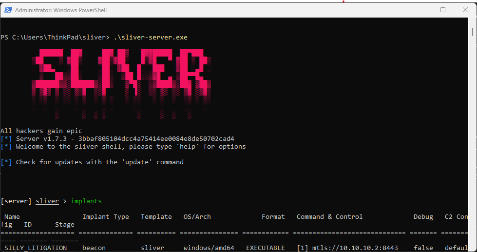
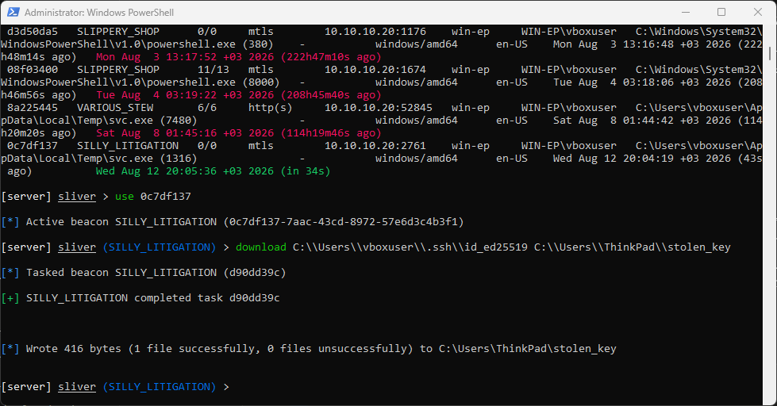
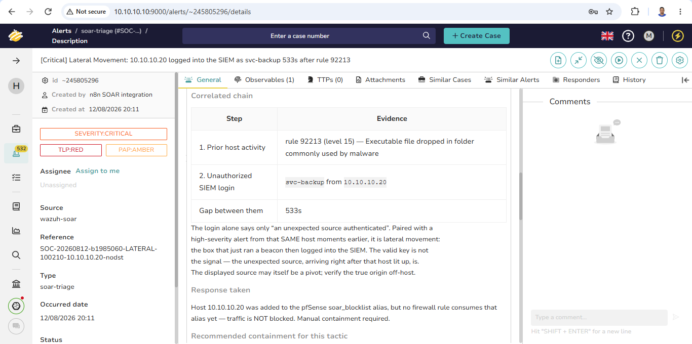
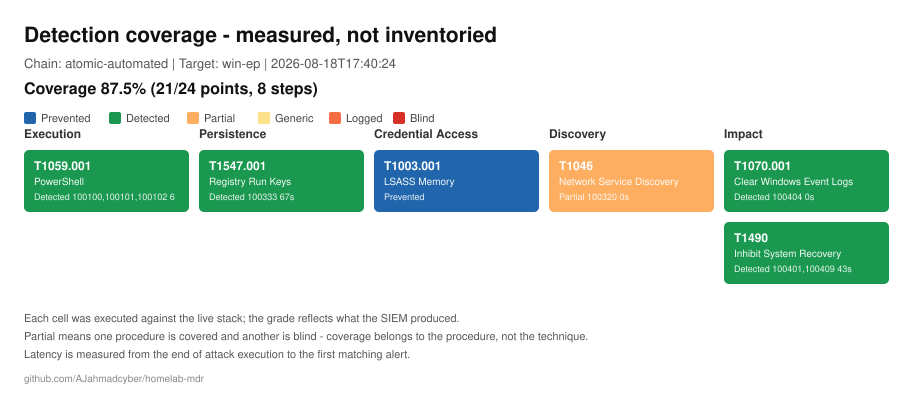

# Homelab MDR — SOC Detection Engineering Lab

> A detection-and-response lab where the detections are written, the attacks are
> run against them, and the coverage is measured rather than claimed.


---

## Overview

A hands-on lab demonstrating detection engineering with open-source tools: collecting Windows and Linux telemetry into a SIEM, running a network IDS at the firewall, writing custom detection rules, mapping every detection to MITRE ATT&CK, and hardening the monitoring stack itself. Everything is version-controlled, with each build phase documented alongside its design rationale.

The lab is built in phases — infrastructure and visibility first, then detection content, then response automation, then case management and enrichment, and finally measurement. All eight phases are implemented and working. Phase 7 — a full-lifecycle intrusion modeled on a real 2026 ransomware operation (The Gentlemen / GentleKiller RaaS) — is emulated stage by stage from edge exploitation through to encryption, with every stage validated attack → detection → SOAR → ticket.

Build procedure: [`docs/build/INSTALL.md`](docs/build/INSTALL.md) is the ordered path from nothing to a running lab, with a verification step after each stage and the download sources recorded in [`docs/build/sources.md`](docs/build/sources.md).

Everything runs locally on a single hypervisor host. All attack simulations target only lab VMs under my control.

---

## What this actually produces

Four screenshots from the running lab. Everything below happened against the
live stack; nothing is a mockup.

**A live C2 beacon on the endpoint** — the Sliver implant running in memory
after the fileless loader stage, which is what the endpoint rules are written
against.



**The SSH key stolen over the encrypted C2 channel** — no file handle on disk,
no SSH session. This is why detection lands on the *use* of the key rather than
its theft.



**The resulting ticket** — the lateral-movement chain, correlated cross-host
from two alerts that would each have been closed as noise alone, with the
investigation plan the tactic dictates.



**Measured coverage** — produced by running the attack and grading what the SIEM
returned, not by counting rules.



Full evidence set, phase by phase, in [`docs/evidence/`](docs/evidence/).

---

## Status

| Phase | Scope | State |
| --- | --- | --- |
| 1 — Foundation | VMs, network, Docker, Wazuh stack (Manager + Indexer + Dashboard) | ✅ Implemented |
| 2 — Hardening | UFW, fail2ban, SSH hardening, index retention | ✅ Implemented |
| 3 — Windows telemetry | Sysmon (sysmon-modular), PowerShell Script Block Logging (4104), ASR, Defender → Wazuh agent | ✅ Implemented |
| 4 — Network re-architecture | pfSense in-path gateway, LAN segmentation | ✅ Implemented |
| 4.5 — SIEM self-monitoring | Agent on the SIEM + auditd, tamper detection for the monitoring stack | ✅ Implemented |
| 5 — Network IDS + DNS detection | Suricata on pfSense + Suricata→Wazuh pipeline, DNS tunneling + behavioral C2 beaconing | ✅ Implemented |
| 6-A — SOAR pipeline | Wazuh → n8n integration, high-severity alert triage and routing | ✅ Implemented |
| 6-B — Automated response | Host isolation via pfSense REST API + allowlist + circuit breaker + investigation tickets | ✅ Implemented |
| 6-C — Case management + enrichment | TheHive 5 (BerkeleyDB + Lucene) + Cortex (8 analyzers wired across two pipelines), ATT&CK-classified tickets, phishing triage pipeline | ✅ Implemented |
| 7 — Adversary emulation (GentleKiller kill-chain) | Full-lifecycle intrusion emulated stage by stage — see sub-phases below | ✅ Implemented |
| ↳ 7-A — Initial Access | Edge exploitation: CVE-2024-55591 (FortiOS auth-bypass) URI signature; nmap + Nuclei recon — Suricata rules | ✅ Implemented |
| ↳ 7-B — Fileless Execution → C2 | In-memory Sliver beacon via PowerShell reflective loader (no disk write); LOLBin outbound + beaconing confirm | ✅ Implemented |
| ↳ 7-C — Persistence | ASEP autostart write, writer-agnostic — fires even when the implant writes via the Registry API, not reg.exe | ✅ Implemented |
| ↳ 7-D — Defense Evasion / BYOVD | Kernel driver load from user-writable paths, security-tooling termination, code-integrity tampering, and the correlation that ties a driver load to a kill | ✅ Implemented |
| ↳ L4 — Resilient detection | The surviving channel: endpoint heartbeat + off-host network liveness, so a silenced agent is told apart from a machine that was switched off | ✅ Implemented |
| ↳ SIEM self-health | Detects the SIEM's own engine dying silently (a bad rule file kills analysisd while the container still reports Up) and recovers it | ✅ Implemented |
| ↳ 7-E — Lateral Movement | SSH key stolen over the Sliver C2 channel → Ligolo-ng tunnel → valid-account login to the SIEM; allowlist detection (100210/100211) + cross-host SOAR correlation, proven end-to-end through the pivot | ✅ Implemented |
| ↳ 7-F — Impact | The objective stage: volume enumeration → recovery-capability destruction (shadow copies, backup catalogue, System Restore, boot recovery) → mass encryption → event-log clearing. Sixteen rules across five techniques, validated by two independent tools | ✅ Implemented |
| 8 — Coverage engine | Automated execution over WinRM, per-technique scoring against the Indexer, ATT&CK Navigator layer and SVG heatmap generated from measured results | ✅ Implemented (chain A) |

---

## Architecture

pfSense sits in-path as the gateway, so all routed traffic passes through it — the natural place for a network IDS. Endpoints report host telemetry to the SIEM; Suricata reports network detections. Detection is layered on purpose: no single sensor sees everything.

| VM | OS | RAM | Role | IP |
| --- | --- | --- | --- | --- |
| `siem` | Ubuntu Server 22.04 | 5.9 GB | Wazuh Manager + Indexer + Dashboard, TheHive 5, Cortex + Elasticsearch, n8n (all Docker Compose) | 10.10.10.10 |
| `win-ep` | Windows 10 | 2 GB | Endpoint: Sysmon (sysmon-modular) + ASR + Wazuh agent — powered on for attack validation | 10.10.10.20 |
| `pfSense` | pfSense 2.7.2 | 1.5 GB | In-path gateway + Suricata 7.0.8 IDS + REST API (SOAR containment) | 10.10.10.1 |
| Host | Windows 11 + VirtualBox | 16 GB | Hypervisor — and the attacker platform (Sliver C2, Ligolo-ng, nmap, Nuclei), architecturally external to the LAN | 10.10.10.2 |

Network: LAN `10.10.10.0/24`, pfSense in-path (WAN via NAT), default-deny egress.

---

## Detection engineering

Every custom rule is mapped to a MITRE ATT&CK technique, with IDs namespaced by phase. The table below lists **detections I wrote and verified firing** — not planned coverage.

### Custom detections (rules I wrote)

| Technique | Detection | Layer | Rule IDs |
| --- | --- | --- | --- |
| T1046 — Network Service Discovery | Custom Suricata SYN-scan signatures → Wazuh MITRE rules | Network | Suricata 1000001/1000002 → 100300–100304 |
| T1190 — Exploit Public-Facing Application | Fortinet CVE-2024-55591 auth-bypass URI pattern at the edge (HTTP only — TLS hides the URI) | Network | Suricata sid 100350 → 100308 |
| T1048 — Exfiltration Over Alternative Protocol | Suricata long-subdomain DNS heuristic → Wazuh | Network (DNS) | Suricata 1000003 → 100305 |
| T1071.004 — Application Layer Protocol: DNS | Behavioral C2 beaconing (rate-based, per eTLD+1) via custom SIEM-layer analyzer | SIEM (behavioral) | 100306 / 100307 |
| T1059.001 — PowerShell | Script Block Logging (Event 4104) obfuscation patterns | Endpoint | 100100–100102 |
| T1003.001 — LSASS Memory | comsvcs.dll MiniDump detected via **process command line (Sysmon EID 1)** — EID 10 is dropped by event-size limits, so EID 1 is the reliable path | Endpoint | 100311 |
| Credential theft — Mimikatz | Mimikatz signatures in PowerShell 4104 script blocks | Endpoint | 100312 |
| Credential theft — browser stores | Browser credential-store access (esentutl / Login Data) | Endpoint | 100313 |
| T1068 / T1543.003 — BYOVD driver load | Kernel driver loaded from a user-writable path — keys on **path, not signer**, because a validly signed vulnerable driver is the technique, not an exception to it | Endpoint | 100340–100343 |
| T1562.001 — Security tooling terminated | Termination of a resident security service, plus a frequency rule for the mass-kill shape | Endpoint | 100370 / 100371 |
| T1068 + T1562.001 — **BYOVD chain** | Driver load followed by a security-tooling kill on the same host inside 5 minutes — the pair is the finding; correlated in the SOAR layer, not the rule engine | SOAR | n8n correlation node |
| T1562.001 / T1553.006 — Code-integrity tampering | HVCI, vulnerable-driver blocklist, Credential Guard or TestSigning modified — fires one step *earlier* than the driver load | Endpoint | 100380 / 100381 |
| T1562.001 / T1562.008 — **Agent silenced** | Endpoint telemetry stops while the firewall still sees the host issuing DNS — a killed agent, told apart from a powered-off machine | SIEM + Network | 100359–100366 |
| T1562.001 — SIEM engine down | The rule engine itself stops evaluating (bad rule file kills analysisd; container still reports Up) — detected and auto-recovered | SIEM host | 100395–100399 |
| T1562.001 / T1611 / T1610 / T1548.003 / T1098 / T1543.002 / T1562.004 | SIEM self-monitoring (auditd) — tamper detection for the monitoring stack | SIEM host | 100200–100208 |
| T1078 + T1021.004 — **Unauthorized SIEM access** | Successful SSH publickey login to the SIEM from any source outside the admin-jump allowlist — the valid key is not the signal, the *unexpected source* is; CDB `address_match_key` allowlist, detect-only (management plane) | SIEM host | 100210 / 100211 |
| T1078 + T1021.004 — **Lateral-movement chain** | The SIEM login correlated in the SOAR with a recent high-severity alert from the same source host — two orphan tickets become one Critical incident (the "raise attention on the host" pattern); cross-host, so the pivot's real origin is provable | SOAR | n8n correlation node |
| T1082 — System Information Discovery | Volume enumeration (`Win32_Volume`) seen on **two independent channels** — Sysmon EID 1 and PowerShell module logging (EID 4103) — because the same recon reaches the SIEM differently depending on how it was invoked | Endpoint | 100400 / 100408 |
| T1490 — Inhibit System Recovery | Every documented path to destroying recovery, not just the famous one: `vssadmin delete shadows`, `wmic shadowcopy delete`, PowerShell WMI deletion, `wbadmin delete catalog`, `bcdedit` recovery disable, `vssadmin resize shadowstorage`, System Restore registry and scheduled-task disable | Endpoint | 100401 / 100402 / 100409–100416 |
| T1489 — Service Stop | Termination of a security or backup service — the step that frees locked files before encryption | Endpoint | 100403 |
| T1486 — Data Encrypted for Impact | FIM-driven: a **frequency** rule on the modification burst (15 changes in 120s) plus an artifact rule on the ransom note and the encrypted extension — shape and artifact, not file hash | Endpoint (FIM) | 100405–100407 |
| T1070.001 — Clear Windows Event Logs | `wevtutil cl` — anti-forensics, with a ticket playbook that pivots the analyst to the off-host SIEM copy the local wipe cannot reach | Endpoint | 100404 |


### Phase 7 — adversary emulation

Each stage was driven by real tooling from the attacker host and validated
attack -> Sysmon/Suricata -> Wazuh -> SOAR -> TheHive. The command run at
each stage, and the rules it fired, are tabulated in
[`docs/attack-commands.md`](docs/attack-commands.md).

### The DNS behavioral C2 detection (Phase 5)

Signature matching is the weakest tier of the Pyramid of Pain — rewrite the tool and the signature is dead. Rather than fingerprint a C2 tool, this detection targets an **intrinsic property of the C2 channel**: beaconing repetition. A rate-based analyzer groups DNS queries by `(src_ip, eTLD+1)` over a rolling window and flags parents whose query volume is anomalous, with an allowlist for legitimate high-volume domains.

```
Suricata eve.json (pfSense)
  → edge filter: event_type=dns, type=query   (answers dropped at the sensor)
  → dns-pull.sh — byte-offset batch pull via cron (no persistent tail, no collision with the alert collector)
  → c2-detect.py — rate-based analyzer, eTLD+1 grouping, allowlist → SOAR-ready JSON alert
  → /var/log/dns-analyzer/alerts.json  (Docker bind-mount into Wazuh)
  → Wazuh JSON decoder → rules 100306/100307 → MITRE T1071.004
```

The analyzer lives in the SIEM layer, not the IDS — clean separation of concerns: Suricata reads the wire, the analyzer reasons about behavior, Wazuh correlates and alerts. Alerts are emitted as SOAR-ready JSON (`parent_domain` + `src_ip` + `query_count`) so Phase 6 can enrich and act on them directly.

### The Suricata → Wazuh alert pipeline (Phase 5)

```
Suricata eve.json (pfSense)
  → edge filter: event_type=alert only (protocol logs dropped at the sensor)
  → SSH stream, siem PULLs via a systemd service (Restart=always)
  → /var/log/suricata-pfsense/eve-alerts.json  (Docker bind-mount into Wazuh)
  → Wazuh JSON decoder → custom rules 100300–100305 → MITRE
```

The collector runs as a systemd service on the SIEM (`Restart=always`), so it self-recovers from dropped connections, host suspend, or crashes — no manual watchdog.

### Extended by community rulesets (enabled, not authored here)

Broad coverage layered on top of the custom rules, so the lab isn't blind between custom detections:

- **Sysmon-modular + Wazuh community (host-side):** LOLBAS abuse (certutil / mshta / wmic and similar living-off-the-land binaries), lateral movement (WinRM / Invoke-Command / PsExec patterns), scheduled tasks, image loads, file drops, LSASS *access* events.
- **ET Open + Snort GPLv2 Community (network-side, Suricata):** broad network signature coverage for scanning, exploit, and malware traffic patterns.

---

### SOAR pipeline (Phase 6-A)

Detection is wired to orchestration: Wazuh forwards every alert at level ≥ 10 to an n8n workflow that triages and tags it for response. The forwarder is a Wazuh `integration` script; the level filter keeps low-severity noise out of the automation while letting *any* high-severity detection through — so new detections reach the SOAR layer automatically, without per-rule wiring.

```
Wazuh alert (level ≥ 10)
  → integratord runs a custom integration script
  → HTTP POST → n8n production webhook
  → IF (level ≥ 10) → HIGH_PRIORITY (enrich + block, wired in 6-B) / LOW_PRIORITY (logged)
```

n8n runs as its own container (separate compose, isolated from the Wazuh stack, bound to the LAN interface only). The pipeline was validated end to end with **real attacks** against the endpoint — DNS C2 beaconing (T1071.004), Mimikatz (T1003), an LSASS dump via `comsvcs.dll` MiniDump (T1003.001), and browser credential theft via `esentutl /vss` on Chrome and Edge (T1555.003) — all four fired in Wazuh and reached n8n. The SOAR layer is threat-category-agnostic, not tied to any single detection.

Automated *containment* is deliberately deferred to Phase 6-B: blocking runs through the SOAR path with enrichment (Cortex) and safety controls (block TTL, RFC1918 allowlist, circuit breaker) rather than blind inline blocking on a single gateway.

### Automated containment + investigation tickets (Phase 6-B)

The SOAR layer now closes the loop from detection to response. When a high-severity alert reaches n8n, the workflow extracts the source host, runs it past two safety gates, and — if it passes — isolates the host through the pfSense REST API:

```
alert (level >= 10) -> extract src_ip
  -> SAFETY: infrastructure allowlist (gateway / SIEM / analyst host are never blockable)
           + circuit breaker (halt if too many blocks in a short window)
  -> pfSense REST API: add IP to the soar_blocklist alias -> apply
  -> generate a structured investigation ticket
```

The allowlist and circuit breaker are enforced both as visible n8n nodes and in a standalone script, so a bad or spoofed alert can never take down the lab's own infrastructure — verified by tests that deliberately tried to block the gateway and the SIEM (both refused), and a burst that tripped the circuit breaker. The pfSense API key is held as an n8n credential, never written into the exported workflow. The firewall block rule stays disabled (dry-run) by default and is enabled only for live containment tests.

Every alert also produces a professional, TheHive-ready **investigation ticket**: ticket key, priority with an SLA, TLP, MITRE technique, detection details, TheHive-style observables, an event timeline, the automated action taken, enrichment placeholders (for Cortex — VirusTotal / AbuseIPDB), a seven-step L1 investigation checklist, and a disposition field (True Positive / False Positive / Escalated). This gives an analyst a realistic case to triage, mirroring what lands in a real SOC queue.

The whole pipeline was validated end to end with a **real multi-stage APT attack chain** on the endpoint (discovery -> credential access -> persistence -> defense evasion -> C2): 15 detection rules fired across 13 MITRE techniques and 6 tactics, and the DNS C2 detection drove the containment path automatically with no manual step. Automated containment via the firewall's native API is exactly the pattern an enterprise would implement (with PAN-OS / FortiOS APIs in place of the open-source package).

**Containment is reported honestly, and currently reads NOT APPLIED.** The API call succeeds and the source IP lands in the `soar_blocklist` alias, but no firewall rule consumes that alias yet, so traffic is not actually dropped. The ticket says so in plain words rather than claiming an isolation the SOAR has not achieved — a ticket that reports false containment is worse than one that reports none, because the analyst stops responding. A single flag flips it once a LAN block rule sources the alias.

### Enrichment, correlation, and ATT&CK-classified tickets (Phase 6-C)

The workflow grew from a triage-and-block path into a classifier. Fifteen nodes now sit between the webhook and TheHive:

**Enrichment runs on every alert, independent of containment.** An alert that cannot be blocked - one on protected infrastructure - needs *more* analysis, not less. Observables are deduplicated, routed by capability so each type only reaches analyzers that are decisive for it, run with bounded parallelism (3 concurrent analyzer containers, to fit the RAM budget), and rolled up into one verdict. A correctness rule matters here: an analyzer's per-field *colour* is not a verdict, so an informational metric like a domain's resolution count stays visible as context without being read as malicious.

**Two correlation nodes turn pairs of alerts into one finding.** The rule engine cannot do this - `if_matched_*` is built for repetition of the same event, not for chaining events of different kinds. The BYOVD node ties a kernel driver load to a security-tooling kill on the same host inside a window; the lateral-movement node is cross-host, matching an unexpected SIEM login against a recent high-severity alert from the *source* of that login. In both cases the pair is the finding, and neither half would justify a Critical alone.

**The ticket classifies rather than transcribes.** It maps the alert's technique to an ATT&CK tactic, derives severity from three inputs (Wazuh level, tactic weight, threat-intel verdict), and selects an investigation plan built for that tactic - an LSASS dump arrives with dump-specific tasks, a C2 alert with beaconing tasks, an Impact alert with "isolate before investigating" at the top and a `do-not-reboot` label. A technique can override its tactic's plan where the generic one does not fit: process injection under Defense Evasion gets memory-and-parent tasks instead of "restore the control", and log clearing under Impact points the analyst at the off-host SIEM copy the local wipe cannot reach. Containment state shapes the plan too - an alert on protected infrastructure that cannot be auto-contained leads with an escalation step.

**Deduplication keeps the queue usable.** A beacon emits an event roughly every 70 seconds; thirteen identical Critical tickets an hour is alert fatigue, not detection. Identical detections inside a 15-minute window resolve to the same ticket key, which doubles as TheHive's `sourceRef`, so the duplicate is rejected and the open ticket stands. Correlated chains get their own key space - without that, the chain ticket would collide with the plain single-rule ticket already opened in the same window and the most important ticket would be lost silently.

A second pipeline handles **phishing**: a user-reported `.eml` from an IMAP mailbox is parsed, its observables routed through Cortex, and scored on signals that need no prior reputation - brand-lookalike domains (homoglyph normalisation + edit distance), display-name mismatches, SPF/DKIM/DMARC results, anchor-text deception, credential-capture paths, and lure language. On a test sample where every reputation source returned clean (VirusTotal 0/91, URLhaus no results), scoring still reached high risk on seven independent signals - which is the point, because targeted phishing uses domains too new to have any reputation.

## Measured detection coverage (Phase 8)

Detection coverage is measured, not asserted: each technique is executed against
the running stack and graded on what the SIEM actually produced.

The heatmap is above. The engine runs the attack over WinRM, records exactly when each step ran, then
queries the Wazuh Indexer for the window that follows and grades the outcome.
Execution and scoring are separate programs, so a chain can be re-graded after a
rule change without re-running the attack.

Grading uses five outcomes rather than the usual three. **Prevented** records a
technique stopped by ASR before it executed — the best possible result, and one
the conventional green/yellow/red scale cannot express because it assumes the
attack ran. **Generic only** records a built-in rule firing with no technique
mapping and no ticket: neither coverage nor a blind spot, and the single most
actionable finding a run produces. **Logged only** separates a rules problem
from a logging problem, and is the one grade that cannot be read off the alert
stream: it requires going back to the raw archives to ask whether the telemetry
arrived at all. A step is only upgraded from blind to logged on evidence
matching its own `evidence_match` contract in the chain definition. Upgrading on
any archived event in the window would be worthless here — the runner drives
every step through PowerShell, so PowerShell telemetry is present in every
window and every blind spot would silently become a rules problem. Steps whose
attack never executed are excluded rather
than counted as gaps, because a setup failure is not a detection failure.

T1046 is **Partial** for a reason worth stating: rule 100320 keys on a scanner
command line, so it detects the nmap procedure and is blind to a native
PowerShell socket loop. Coverage belongs to the *procedure*, not the technique —
reporting the best outcome would hide a real gap behind a working rule.

That gap has since been characterised rather than merely recorded. The archived
window for the socket-loop step holds 10,581 events from the endpoint, 1,121 of
which carry the scan code itself, against zero alerts on the technique. The
telemetry arrived in volume and no rule was watching for it: this is a rule gap,
not a visibility gap, and the two call for different work. Notably 1,113 of
those matches arrive as PowerShell module logging (4103) and only 2 as script
block logging (4104), so an evidence contract scoped to the script-block channel
would have missed almost all of it and reported a blind spot that was not
there.

Full methodology, the Navigator layer and the auditable scorecard:
[`detection/coverage-engine/`](detection/coverage-engine/).

## Key design decisions

- **Detection before response.** Phase 5 is IDS-only by design; automated blocking is reserved for the SOAR phase with safety controls (block TTL, RFC1918 allowlist, circuit breaker).
- **IDS, not inline IPS (for now).** Inline blocking is a single point of failure on one gateway; start in detection, baseline, then promote high-confidence signatures. Blocking will run through the SOAR path — auditable and reversible.
- **Behavioral over signature for C2.** Signatures are brittle; rate-based beaconing targets a channel property that's costly to evade without breaking the C2.
- **North-south vs east-west.** Suricata sees routed traffic only; same-subnet lateral movement is covered host-side by Wazuh + Sysmon. Layered visibility, not one sensor.
- **DNS is the realistic C2 channel here.** Endpoints resolve through pfSense, so every DNS query is routed and Suricata-visible — unlike same-subnet traffic, which is L2-switched and never crosses the gateway.
- **Edge filtering.** Only actionable data is shipped to the SIEM; raw protocol logs stay at the sensor. Keeps the SIEM focused and storage bounded.
- **Detect the evasion, not just the command.** A command-line rule assumes the attacker runs the tool under its own name. Copying `vssadmin.exe` to `svc.exe` defeats every recovery rule here at once, and the command line that remains carries none of the keywords they match. `originalFileName` comes from the PE header and survives the rename, so a rule keyed on the disagreement between the name in the binary and the name on disk catches the evasion itself — and the mismatch is a stronger signal than the command was, since renaming a recovery utility has no benign explanation. The field was already being collected; nothing was watching it.
- **Monitor the monitor.** The SIEM is a high-value target, so tampering with the monitoring stack itself is detected (Phase 4.5).

Full rationale in [`docs/`](docs/). Sources that shaped the detection content — what was taken from each and which rule it produced — are accounted for in [`docs/references.md`](docs/references.md).

---

## Repository layout

Annotated tree with each rule file mapped to its IDs:
[`docs/repository-layout.md`](docs/repository-layout.md).

---

## What is not built yet

The lab is complete as a working system; these are the extensions worth
building next, listed so the boundary is explicit rather than implied.

**Coverage engine.** One chain is measured. The engine is chain-agnostic, so
extending it is a matter of writing more chain definitions — credential access
and discovery are the obvious next two. Scoring a chain against a second
endpoint would also test whether coverage holds on a host that was not the one
the rules were written against.

The **logged-only** grade is implemented but not yet active. `logall_json` is
enabled on the manager, so the archives exist on disk, but Filebeat ships alerts
only and there is no `wazuh-archives-*` index to query. The probe reports the
missing index and leaves the step blind rather than reading zero hits as absence
of evidence — a scoring tool that cannot tell those apart is worse than one that
admits it. Enabling archive shipping needs a retention policy sized for it
first: the archives ran to 4.8 GB in a single month of lab activity.

**Response.** Two containment gaps remain deliberate. Block entries have no TTL,
so an isolated host stays isolated until an operator removes it; the fix needs a
read-modify-write on the pfSense alias, because a `PATCH` with an address array
replaces the whole list instead of appending to it. DNS-level blocking
(Unbound / pfBlockerNG returning NXDOMAIN for an enriched-malicious domain) is
designed but not wired.

**Detection.** Shannon entropy and unique-subdomain cardinality would strengthen
the DNS analyzer against a tunnel that stays under the rate threshold. JA3
fingerprinting would give a TLS-layer C2 signal to sit beside the DNS one. A
reputation-independent signal scorer for network tickets, mirroring the phishing
scorer, is the largest single piece of unbuilt work.

**Known limits, carried honestly.** Sysmon EID 10 for `lsass.exe` is dropped by
Wazuh on event size, so credential-access detection runs on the EID 1 command
line instead. `auditd` does not capture commands issued over a non-interactive
SSH session. Suricata's HTTP URI rules see cleartext only, so the edge signature
is blind once the management interface is behind TLS.

---


## License

MIT — see [`LICENSE`](LICENSE).
